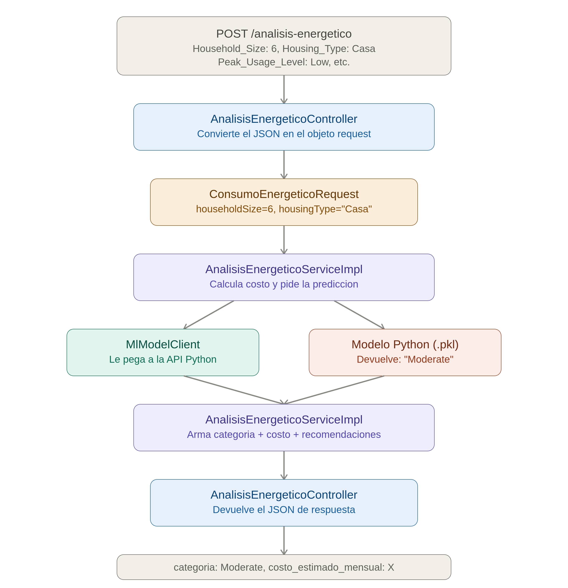
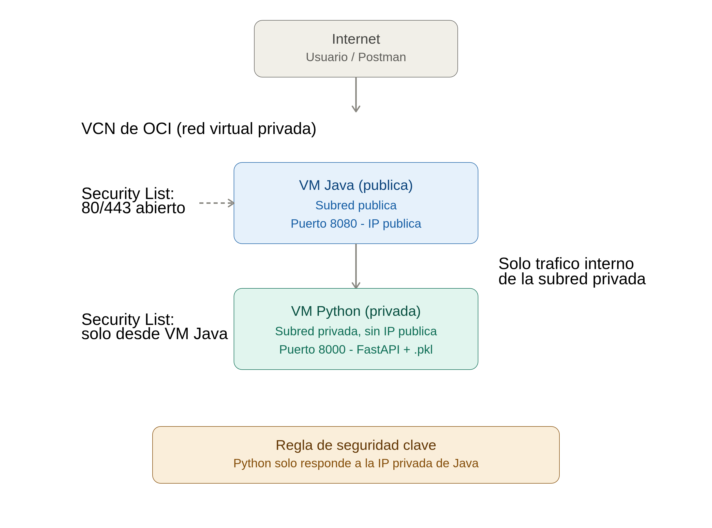

# ⚡ EnergIAi API — Backend Service

API REST desacoplada y de alta performance para el procesamiento, análisis e integración del consumo energético en tiempo real.

Este backend está diseñado bajo una arquitectura por capas, garantizando resiliencia y separación limpia de responsabilidades frente a los modelos de inteligencia artificial y consumo de clientes.

---

## 📋 Descripción del problema

El monitoreo de consumo energético requiere un backend robusto capaz de gestionar peticiones, validar entradas y comunicarse de forma segura con modelos predictivos externos.

Este servicio actúa como el orquestador central: recibe las solicitudes de consumo, procesa la lógica de negocio en Java y se conecta de forma agnóstica con servicios externos (como los modelos de Machine Learning desarrollados en Python).

---

## 🏗️ Arquitectura de la aplicación

```
┌──────────────┐     HTTP REST     ┌────────────────────────┐
│   Postman /  │ ────────────────▶ │  EnergIAi API (Java)   │
│   Frontend   │ ◀──────────────── │  Spring Boot 3.3 +     │
└──────────────┘                   │  Virtual Threads       │
                                    └───────────┬────────────┘
                                                │
                                 ┌──────────────┴──────────────┐
                                 ▼                             ▼
                       ┌──────────────────┐          ┌──────────────────┐
                       │ Client Layer     │          │ Persistencia BDD │
                       │ (Python ML Model │          │ (PostgreSQL /    │
                       │ / Fallback Mock) │          │ TimescaleDB)*    │
                       └──────────────────┘          └──────────────────┘
```

\* Nota: La capa de persistencia en base de datos está planificada como un hito incremental futuro.

📌 El recorrido completo de una petición, capa por capa, con datos reales de ejemplo:



---

## ☁️ Arquitectura de infraestructura (OCI)

El proyecto se despliega sobre **dos máquinas virtuales (Oracle Cloud Infrastructure — Free Tier)**, separadas por motivos de seguridad y de responsabilidad:

| Máquina | Rol | Acceso | Puerto |
|---|---|---|---|
| **VM Java** | Backend principal (Spring Boot) | Pública — accesible desde internet | 8080 |
| **VM Python** | Servicio de Machine Learning (FastAPI + modelo `.pkl`) | Privada — **solo accesible desde la VM Java**, dentro de la misma VCN | 8000 |

La VM de Python **no tiene IP pública ni acceso desde internet**. Solo responde a peticiones que provienen de la IP privada de la VM Java, dentro de la misma **VCN (Virtual Cloud Network)** de OCI. Esto reduce la superficie de ataque: nadie externo puede consultar directamente el modelo de IA, únicamente a través de nuestra API en Java, que valida y orquesta cada solicitud.



> ⚠️ Las IPs reales de cada máquina se completan una vez desplegadas. Ver sección [Despliegue en OCI](#-despliegue-en-oci).

---

## 🛠️ Tecnologías utilizadas

| Componente | Tecnología |
|---|---|
| Lenguaje | Java 21 (Virtual Threads / LTS) |
| Framework | Spring Boot 3.3.x |
| Integración externa | Spring Web Client / RestClient (comunicación con API Python) |
| Herramienta de Construcción | Maven |
| Documentación | Swagger / OpenAPI 3 |
| Control de versiones | Git + GitHub (feature/hpg-backend-java) |
| Infraestructura | Oracle Cloud Infrastructure (OCI) — 2 VM Compute (Free Tier) |
| Persistencia (Fase Futura) | PostgreSQL + TimescaleDB / Flyway |

---

## 📁 Estructura del proyecto

```
energiai-api/
├── .gitignore
├── pom.xml
├── README.md
├── docs/
│   └── images/                              # Diagramas de arquitectura y flujo, referenciados en este README
├── postman/                                 # Colección de Postman para probar los endpoints (ver sección Postman)
└── src/
    ├── main/
    │   ├── java/
    │   │   └── com/
    │   │       └── energiai/
    │   │           └── api/
    │   │               ├── client/          # Clientes para consumir la API de Python (con Mock-Fallback)
    │   │               ├── config/          # Configuraciones globales (CORS, Beans, RestClient)
    │   │               ├── controller/      # Endpoints REST anémicos
    │   │               ├── exception/       # Manejador global de excepciones
    │   │               ├── model/
    │   │               │   ├── dto/
    │   │               │   │   ├── request/  # DTOs de entrada
    │   │               │   │   └── response/ # DTOs de salida
    │   │               │   └── entity/       # Entidades de dominio (fase futura)
    │   │               ├── repository/      # Capa de acceso a datos (fase futura)
    │   │               ├── service/         # Interfaces de lógica de negocio
    │   │               │   └── impl/        # Implementación del negocio
    │   │               └── EnergiaiApiApplication.java
    │   └── resources/
    │       ├── application.properties
    │       └── db/
    │           └── migration/               # Scripts de Flyway (Fase Futura)
    └── test/                                # Tests unitarios con JUnit 5 y Mockito
```

---

## ⚙️ Instalación y ejecución local

### 1. Cloná el repositorio y posicionate en tu rama

```bash
git clone https://github.com/No-Country-simulation/G9-LATAM-Team-57.git
cd energiai-api
git checkout feature/hpg-backend-java
```

### 2. Compilá e iniciá la aplicación

En Windows (PowerShell / CMD):
```bash
mvnw.cmd spring-boot:run
```

En Linux / macOS / Git Bash:
```bash
./mvnw spring-boot:run
```

La aplicación estará escuchando en: http://localhost:8080

---

## 📊 Contrato de datos con el modelo (Data Science)

El equipo de Ciencia de Datos entrena el modelo con un dataset propio. Estas son las variables **ya confirmadas y cerradas** por el equipo de Data Science, y cómo se traducen al backend en Java.

| Columna (Python) | Dtype | Tipo en Java | Descripción |
|---|---|---|---|
| `Household_Size` | int64 | `Integer` | Cantidad de personas en el hogar |
| `Has_AC` | int64 | `Integer` | Si el hogar cuenta con aire acondicionado |
| `Home_Office` | bool | `Boolean` | Si se realiza home office en la vivienda |
| `Housing_Type` | object | `HousingType` (enum) | Tipo de vivienda |
| `Equipment_Count` | int64 | `Integer` | Cantidad de equipos eléctricos |
| `Avg_Energy_Consumption_kWh` | float64 | `Double` | Consumo energético promedio diario, calculado por Java (ver sección siguiente) |
| `Peak_Usage_Level` | object | `PeakUsageLevel` (enum) | Nivel de uso en horario pico |

### Enums

Estos dos campos tienen valores fijos y cerrados, confirmados por Data Science, por lo que se modelan como `enum` en vez de `String` libre — así el backend rechaza automáticamente cualquier valor inválido, sin depender de validación manual.

```java
package com.energiai.api.model.dto.request;

public enum HousingType {
    CASA,
    DEPARTAMENTO,
    MONOAMBIENTE
}
```

```java
package com.energiai.api.model.dto.request;

public enum PeakUsageLevel {
    LOW,
    MEDIUM,
    HIGH
}
```

### DTO de entrada

```java
package com.energiai.api.model.dto.request;

public class ConsumoEnergeticoRequest {

    private Integer householdSize;
    private Integer hasAc;
    private Boolean homeOffice;
    private HousingType housingType;
    private Integer equipmentCount;
    private Double avgEnergyConsumptionKwh;
    private PeakUsageLevel peakUsageLevel;

    // getters y setters
}
```

---

## 🧮 Cálculo del consumo energético promedio diario

El usuario **no ingresa directamente** el promedio diario (`Avg_Energy_Consumption_kWh`) — ingresa el **consumo total del mes anterior**. Java se encarga de calcularlo antes de mandarlo al modelo.

**Lógica:**

1. Java obtiene la fecha actual del sistema.
2. Calcula cuál fue el **mes anterior** al actual (no se puede tomar el mes en curso, porque todavía no finalizó y el consumo real no está cerrado).
3. Determina **cuántos días tuvo ese mes anterior** (considerando meses de 28, 29, 30 o 31 días).
4. Divide el consumo total ingresado por esa cantidad de días, obteniendo el promedio diario.

```
Avg_Energy_Consumption_kWh = consumo_total_mes_anterior / cantidad_de_dias_del_mes_anterior
```

Esta lógica se implementa en el **`service`** (`AnalisisEnergeticoServiceImpl`), **antes** de invocar al `client` que se comunica con la API de Python — es lógica de negocio pura, no debe vivir en el `controller` ni en el `client`.

---

## 🔄 Mock-Fallback (Client Layer)

La capa `client/` se comunica con la API de Machine Learning en Python. Como ese servicio puede no estar disponible (todavía no existe, está caído, o tarda demasiado en responder), se implementa un **mecanismo de fallback**:

- Si la API de Python responde correctamente → se usa la predicción real del modelo.
- Si la API de Python falla o no responde → el backend en Java devuelve una respuesta simulada (mock), generada con reglas simples predefinidas (ej: umbrales de consumo), para que el servicio nunca quede completamente caído.

Esto garantiza disponibilidad del servicio aunque la precisión de la respuesta sea menor en ese caso puntual.

---

## 📄 Endpoints del MVP

| Método | Endpoint | Descripción |
|---|---|---|
| GET | `/api/v1/health` | Estado del servicio backend |
| POST | `/analisis-energetico` | Recibe el consumo del usuario, devuelve categoría, probabilidad, recomendaciones y costo estimado mensual |

---

## 📮 Postman

En la carpeta [`/postman`](./postman) se comparte la colección con las requests ya armadas para probar todos los endpoints de la API (incluyendo ejemplos de body para `POST /analisis-energetico`).

Para usarla:
1. Abrí Postman → **Import**
2. Seleccioná el archivo `.json` dentro de la carpeta `postman/`
3. Ejecutá las requests contra `http://localhost:8080` (entorno local) o la IP pública de la VM Java (entorno desplegado)

---

## 🚀 Despliegue en OCI

> 🔧 Sección en construcción — se completa a medida que se aprovisionan las máquinas.

- **VM Java**: IP pública `pendiente`
- **VM Python**: IP privada `pendiente`
- VCN: `pendiente`
- Security Lists configuradas para que la VM Python solo acepte tráfico desde la VM Java.

---

## 👥 Equipo Backend

| Nombre | Rol |
|---|---|
| [Pablo Graff](https://www.linkedin.com/in/hector-pablo-graff/) | Backend Developer |
| Agustina Lerda | Backend Developer |
| [Annie Lehmann](https://www.linkedin.com/in/annie-lehmann/) | Backend Developer |
| [Frank Mijhael Bendezu Hinostroza](https://www.linkedin.com/in/frankm01) | Full Stack Developer |

Developed 💻 from 🇦🇷 who takes 🧉 and ❤️ country music 🤠 🎵🎵🎵 🇨🇦