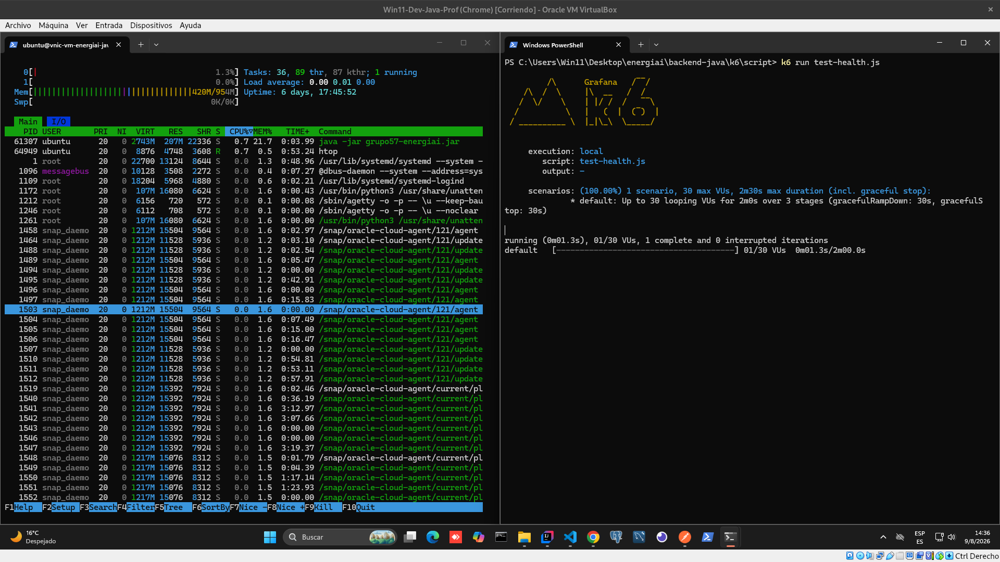

<div align="center">

# ⚡ EnergIAi

### Análisis Inteligente de Consumo Energético

*Transformamos datos crudos de consumo eléctrico en decisiones más sostenibles.*

[](#-tecnologías)
[](#-tecnologías)
[](#-tecnologías)
[](#-tecnologías)
[](#️-arquitectura-de-infraestructura-oci)
[](https://alura-es-cursos.github.io/proyectos-hackathon-g9-latam/)
[](#-estado-del-proyecto)

</div>

---

## 📖 Índice

- [Descripción](#-descripción)
- [Estado del proyecto](#-estado-del-proyecto)
- [Problema](#-problema)
- [Necesidad del cliente](#-necesidad-del-cliente)
- [Validación de mercado](#-validación-de-mercado)
- [Objetivos](#-objetivos)
- [Arquitectura](#️-arquitectura)
- [Arquitectura de infraestructura (OCI)](#️-arquitectura-de-infraestructura-oci)
- [Pruebas de Carga y Rendimiento (Benchmarking)](#-pruebas-de-carga-y-rendimiento-benchmarking)
- [Componentes](#-componentes)
- [Tecnologías](#️-tecnologías)
- [Dataset](#-dataset)
- [Equipo](#-equipo)
- [Cómo ejecutar el proyecto](#-cómo-ejecutar-el-proyecto)
- [Documentación](#-documentación)
- [Roadmap](#️-roadmap)
- [Créditos](#-créditos)

---

## 📋 Descripción

**EnergIAi** es una plataforma que analiza el consumo eléctrico residencial mediante Inteligencia Artificial. A partir de datos como el consumo mensual, la cantidad de equipos y los hábitos de uso en horario pico, la solución:

- Clasifica el perfil energético de una vivienda (**Eficiente**, **Moderado** o **Ineficiente**).
- Genera recomendaciones concretas para reducir el desperdicio energético.
- Estima el impacto financiero mensual del consumo.

Desarrollado para el **Hackathon ONE — Proyectos G9 | Alura + Oracle**, dentro del track *Sostenibilidad, Energía y Casas Inteligentes*.

🔗 [Consigna original del hackathon](https://alura-es-cursos.github.io/proyectos-hackathon-g9-latam/)

---

## 🚦 Estado del proyecto

| Componente | Estado |
|---|---|
| Infraestructura OCI (VCN, subred, Security Lists, 2 VMs) | ✅ Desplegada y operativa |
| API de Machine Learning (Python/FastAPI) | ✅ Desplegada en OCI, corriendo como servicio persistente (systemd) |
| Modelo de clasificación (`.pkl`) | ✅ Entrenado, evaluado y servido en producción |
| Backend principal (Java/Spring Boot) | ✅ Estructura y DTOs listos, falta cablear el cliente HTTP hacia el servicio de ML y desplegar en la VM |
| Front-end | ✅ |

> Este README refleja el estado real del proyecto al momento de la última actualización. La sección de arquitectura OCI y las IPs son definitivas (infraestructura ya desplegada); el resto se irá marcando ✅ a medida que cada componente se complete.

---

## 🧩 Problema

Muchas personas reciben facturas de energía elevadas, pero tienen poca visibilidad sobre qué hábitos de consumo son los que más impactan en sus gastos. **EnergIAi** transforma datos crudos de consumo en información clara y accionable, aplicando Ciencia de Datos para:

- Analizar patrones de consumo eléctrico de una vivienda.
- Clasificar el perfil energético en categorías (Eficiente / Moderado / Ineficiente).
- Generar recomendaciones concretas para reducir el desperdicio energético.
- Estimar el impacto financiero del consumo, usando una tarifa de referencia de **$0.75 USD/kWh**.

### 🎯 Necesidad del cliente

La solución permite a un usuario residencial:

- Comprender su perfil de consumo energético.
- Identificar posibles fuentes de desperdicio.
- Recibir recomendaciones de mejora personalizadas.
- Estimar el costo asociado a su consumo.
- Hacer seguimiento de sus indicadores de eficiencia a lo largo del tiempo.

El objetivo es transformar datos de consumo en información clara y útil para apoyar decisiones más conscientes.

### 📈 Validación de mercado

La preocupación por la eficiencia energética y la sostenibilidad crece continuamente en distintos sectores de la sociedad. Empresas, gobiernos y consumidores buscan soluciones capaces de:

- Reducir costos operativos.
- Mejorar indicadores de sostenibilidad.
- Incentivar el consumo consciente.
- Monitorear patrones de uso de energía.
- Apoyar estrategias de eficiencia energética con datos, no solo con intuición.

Incluso las soluciones simples pueden generar valor al proporcionar análisis y recomendaciones personalizadas con base en los datos de los usuarios.

---

## 🎯 Objetivos

Desarrollar un **MVP funcional** que:

- ✅ Analice patrones de consumo energético.
- ✅ Clasifique el perfil de eficiencia energética mediante un modelo de Machine Learning.
- ✅ Genere recomendaciones de mejora.
- ✅ Estime el impacto financiero con base en una tarifa de referencia.
- ✅ Exponga los resultados mediante una API REST documentada.
- ✅ Utilice al menos un servicio de OCI como parte de la arquitectura.

---

## 🏗️ Arquitectura

```text
                 Usuario
                    │
                    ▼
             API Java (Spring Boot)
             Oracle Cloud (VM Pública)
                    │
                 HTTP REST
                    ▼
        API Machine Learning (FastAPI)
          Oracle Cloud (VM Pública, acceso
          restringido por firewall)
                    │
                    ▼
      Modelo entrenado (Scikit-Learn)
```

El backend en **Java** actúa como orquestador central: recibe la solicitud de consumo, ejecuta la lógica de negocio (cálculo del promedio diario), valida los datos y se comunica de forma agnóstica con el modelo de Machine Learning servido en **Python**.

> 📌 El detalle completo del recorrido de una petición, capa por capa y con datos reales de ejemplo, está documentado en [`backend-java/README.md`](./backend-java/README.md).

---

## ☁️ Arquitectura de infraestructura (OCI)

El proyecto está desplegado sobre **dos máquinas virtuales de Oracle Cloud Infrastructure (Free Tier)**, dentro de la VCN `vcn-energiai` (`10.0.0.0/16`), subred `subnet-energiai-public` (`10.0.0.0/24`), región Brazil East (São Paulo):

| Máquina | Rol | IP pública | IP privada | Puerto | Estado |
|---|---|---|---|---|---|
| **VM Java** | Backend principal (Spring Boot) | `163.176.43.143` | `10.0.0.213` | 8080 | ✅ Desplegado y corriendo (systemd) |
| **VM Python** | Servicio de Machine Learning (FastAPI + modelo `.pkl`) | `147.15.16.156` | `10.0.0.164` | 8000 | ✅ Desplegado y corriendo (systemd) |

**Nota sobre el acceso a la VM Python:** el diseño original preveía una subred privada sin salida a internet, pero las cuentas *Always Free* de OCI no incluyen NAT Gateway. Por eso la VM Python tiene IP pública (necesaria para instalar dependencias), y la restricción de acceso se logra por **reglas de firewall**: la Security List de OCI y el `iptables` interno solo aceptan tráfico al puerto 8000 desde la subred interna (`10.0.0.0/24`), nunca desde internet. En la práctica, el resultado de seguridad es el mismo — nadie externo puede consultar el modelo directamente — logrado por firewall en vez de aislamiento de red.

> 🔧 Detalle completo del proceso de configuración de OCI (paso a paso, decisiones y problemas resueltos) en [`oci/README.md`](./oci/README.md).

---

## ⚡ Pruebas de Carga, Rendimiento y Elasticidad (Benchmarking)

Para garantizar un estándar de producción real, la API desplegada en **Oracle Cloud Infrastructure (OCI)** fue sometida a pruebas de carga destructiva y concurrencia utilizando **Grafana k6**, monitoreando en tiempo real la salud del hardware (`htop`) en la Virtual Machine Ubuntu.

---

### 🏥 1. Diagnóstico de Infraestructura (`GET /health`)
* **Concurrencia Probada:** Ráfagas de hasta **30 usuarios virtuales (VUs)** simultáneos.
* **Elasticidad de Procesador:** La JVM despertó los núcleos bajo demanda pasando de **0.7% a 27.2% de CPU**, retornando al estado basal inmediatamente al finalizar.
* **Métrica SLA:** Latencia **$p(95) = 57.37\text{ ms}$** y **0.00% tasa de fallos** sobre 1,687 peticiones.

| 🟢 1. Estado Inicial (Basal) | 🟡 2. Pico de Carga (30 VUs) | 🟢 3. Reporte Final (`k6`) |
|:---:|:---:|:---:|
|  |  |  |
| *Servidor en reposo (0.7% CPU, ~420 MB RAM).* | *Escalado elástico de CPU sin degradar la memoria.* | *1,00% de éxito, 0% errores y $p(95) < 58\text{ ms}$.* |

---

### 🧪 2. Servicio de Ingesta y Cálculo Energético (`POST /analisis-energetico`)
* **Carga de Negocio:** Procesamiento e interpretación de DTOs JSON con evaluación del perfil energético.
* **Estabilidad de Memoria:** Memoria RAM congelada en **418 MB / 954 MB** demostrando la ausencia de fugas de memoria (*memory leaks*).
* **Métrica SLA:** Latencia **$p(95) = 74.36\text{ ms}$** y **0.00% tasa de fallos** sobre 133 peticiones reales.

| 🟢 1. Estado Inicial (Basal) | 🟡 2. Pico de Carga (5 VUs) | 🟢 3. Reporte Final (`k6`) |
|:---:|:---:|:---:|
|  |  |  |
| *Servidor listo para recibir payloads de ingesta.* | *Absorción de carga JSON manteniendo consumo en ~418 MB.* | *133 peticiones POST procesadas en $< 75\text{ ms}$.* |

---

## 📦 Componentes

| Carpeta | Responsabilidad | Documentación |
|---|---|---|
| [`backend-java/`](./backend-java) | API principal, orquestación y lógica de negocio | [README](./backend-java/README.md) |
| [`backend-python/`](./backend-python) | Servicio de Machine Learning (inferencia) | [README](./backend-python/README.md) |
| [`data-science/`](./data-science) | Entrenamiento, evaluación y serialización del modelo | [README](./data-science/README.md) |
| [`oci/`](./oci) | Configuración de infraestructura en Oracle Cloud | [README](./oci/README.md) |
| `docs/` | Diagramas de arquitectura y flujo | — |
| `postman/` | Colección de Postman para probar los endpoints | — |

Cada componente cuenta con su propio README técnico.

---

## 🛠️ Tecnologías

| Área | Tecnología |
|---|---|
| Backend | Java 21 (Virtual Threads) + Spring Boot 3.3.x |
| Machine Learning | Python 3.12 + FastAPI |
| Ciencia de Datos | Pandas + Scikit-Learn |
| Infraestructura | Oracle Cloud Infrastructure (2 VM Compute, Free Tier) |
| Documentación de API | Swagger / OpenAPI 3 |
| Control de versiones | Git + GitHub |
| Persistencia (fase futura) | PostgreSQL + TimescaleDB / Flyway |

---

## 📊 Dataset

El modelo de clasificación fue entrenado con el dataset público **[Household Energy Consumption](https://www.kaggle.com/datasets/samxsam/household-energy-consumption)** (Kaggle), que registra consumo diario de energía, temperatura y niveles de uso en horario pico por hogar.

El equipo de Data Science procesó este dataset (EDA, limpieza, entrenamiento y evaluación) y exportó el modelo entrenado en formato `.pkl`, servido en producción desde la API en Python.

> Detalle completo de variables, metodología y métricas en [`data-science/README.md`](./data-science/README.md).

---

## 👥 Equipo

| Nombre | Rol | Aporte |
|---|---|---|
| **[Jonathan Marino](https://www.linkedin.com/in/jonathan-marino/)** | Data Analyst | Exploración y limpieza de datos (EDA) |
| **[Hernán Pérez Melgar](https://www.linkedin.com/in/hernan-perez-melgar-320088184/)** | Data Scientist | Entrenamiento del modelo, serialización (`.pkl`) |
| **[Pablo Graff](https://www.linkedin.com/in/hector-pablo-graff/)** | Backend Developer | API Java/Spring Boot, API de Machine Learning (FastAPI) e infraestructura OCI |
| **[Agustina Lerda](https://www.linkedin.com/in/agustina-lerda/)** | Backend Developer | API Java/Spring Boot |
| **[Annie Lehmann](https://www.linkedin.com/in/annie-lehmann/)** | Backend Developer | API Java/Spring Boot |
| **[Frank Mijhael Bendezu Hinostroza](https://www.linkedin.com/in/frankm01)** | Full Stack Developer | Front-end / soporte transversal |

---

## ⚙️ Cómo ejecutar el proyecto

### 1. Cloná el repositorio

```bash
git clone https://github.com/No-Country-simulation/G9-LATAM-Team-57.git
cd energiai
```

### 2. Levantá el servicio de Machine Learning (Python)

```bash
cd backend-python
pip install -r requirements.txt
uvicorn app.main:app --host 0.0.0.0 --port 8000 --reload
```

### 3. Levantá la API principal (Java)

En Windows (PowerShell / CMD):
```bash
cd backend-java
mvnw.cmd spring-boot:run
```

En Linux / macOS / Git Bash:
```bash
cd backend-java
./mvnw spring-boot:run
```

La API principal queda disponible en `http://localhost:8080` y consume internamente al servicio de Python en `http://localhost:8000` (local) o `http://10.0.0.164:8000` (en OCI).

> Si el servicio de Python no está disponible, la API Java activa automáticamente un mecanismo de **Mock-Fallback** para no interrumpir el servicio. Ver detalle en [`backend-java/README.md`](./backend-java/README.md#-mock-fallback-client-layer).

---

## 📚 Documentación

- [`backend-java/README.md`](./backend-java/README.md) — API principal, arquitectura, DTOs, endpoints, Mock-Fallback y despliegue en OCI.
- [`backend-python/README.md`](./backend-python/README.md) — Servicio de Machine Learning, contrato de inferencia y ejecución con Docker.
- [`data-science/README.md`](./data-science/README.md) — Dataset, metodología, modelo entrenado y métricas de evaluación.
- [`oci/README.md`](./oci/README.md) — Configuración de infraestructura, paso a paso, decisiones y problemas resueltos.
- [`postman/`](./postman) — Colección de Postman con requests listas para probar la API.

---

## 🗺️ Roadmap & Evolución de Arquitectura

El backend del proyecto atravesó una fase de **Refactorización y Reingeniería de Performance (V2.0)** para elevar el estándar de la API desde un prototipo básico hacia un servicio resiliente, preparado para producción y de alta concurrencia.

### 📊 Matriz de Madurez Técnica (Backend)

| Dimensión Técnica | Prototipo Base (V1.0) | Estado Actual en Producción (V2.0 - Senior Overhaul) |
| :--- | :---: | :---: |
| **Runtime & Lenguaje** | Java Estándar | **Java 21 LTS** (Optimizado para I/O concurrente) |
| **Infraestructura** | Entorno Local | **Oracle Cloud Infrastructure (OCI)** en VM dedicada |
| **Benchmarking & Carga** | Sin pruebas | **Grafana k6 Auditado** ($p(95) < 75\text{ ms}$, 0% fallos) |
| **Monitoreo de Recursos** | Sin métricas | **Observabilidad de RAM/CPU** (`htop` en tiempo real) |
| **Manejo de Errores** | Excepciones genéricas | **Global Exception Handler** con DTOs de auditoría |
| **Integración ML** | Acoplamiento simple | **Cliente REST Resiliente** con manejo de Timeout/Fallback |

---

### 🟢 Hitos Completados (Fase 1: Backend Enterprise & Nube)
- [x] **Reingeniería del Core Spring Boot:** Migración a Java 21 LTS y arquitectura por capas agnóstica.
- [x] **Despliegue Continuo en OCI:** Instancia VM configurada, operativa y accesible remotamente.
- [x] **Auditoría de Memoria y Resiliencia:** Verificación de consumo ($418\text{ MB}$ estables) descartando *memory leaks*.
- [x] **Suite de Stress Testing:** Creación de scripts `k6` para validación de SLAs bajo ráfagas de tráfico.
- [x] **Integración con Inferencia ML:** Contrato REST estricto para cálculo y predecibilidad energética.

### 🟡 Próximos Hitos (Fase 2: Cliente & Persistencia Avanzada)
- [ ] **Sincronización con Nuevo Frontend:** Consumo de la API desde la interfaz de usuario final (*Plug & Play*).
- [ ] **Evolución a Base de Datos Temporal:** Implementación de TimescaleDB sobre PostgreSQL para histórico de telemetría.
- [ ] **Control de Esquemas con Flyway:** Gestor de migraciones versionadas de base de datos desde el inicio.
- [ ] **Ingesta Masiva en Lote:** Procesamiento asíncrono de archivos CSV de alto volumen.

---

## 🙌 Créditos

Proyecto desarrollado en el marco del **Hackathon ONE — Proyectos G9 | Alura + Oracle**.

Developed 💻 from 🇦🇷 and 🇵🇪.
